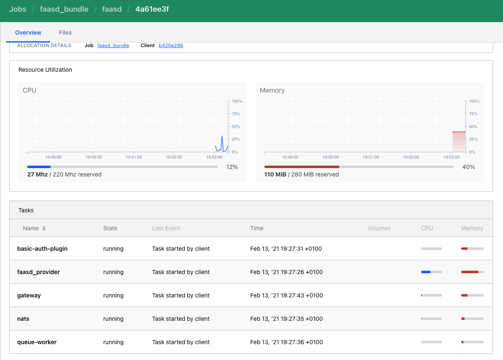
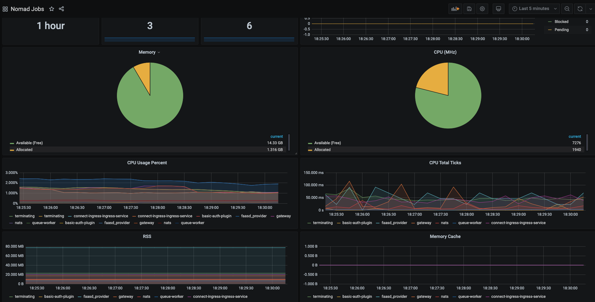

# Hashicorp Labs

This repo contains tools for testing and experimenting with Hashicorp software.

But not only that..you can play with `OpenFaas` serverless stuff too! Keep reading.

It will deploy a cluster for `Vault`, `Consul` and `Nomad` where each component will be connected together to form a perfect environment for testing your applications with service mesh.

**Table of Contents**
- [Hashicorp Labs](#hashicorp-labs)
  - [Install cluster with Vagrant](#install-cluster-with-vagrant)
  - [Provision and deploy](#provision-and-deploy)
  - [Play with microservices](#play-with-microservices)
  - [OpenFaas in Nomad](#openfaas-in-nomad)
    - [Monitoring OpenFaas](#monitoring-openfaas)
    - [Docker login (for OpenFAAS)](#docker-login-for-openfaas)
  - [Clean up](#clean-up)


## Install cluster with Vagrant

> WARNING: At the moment the clusters will be loaded in `dev` mode. If the services will fail, you will lose every data since the backends are loaded in memory.

> Vagrant file is taken partially from here [hashicorp's nomad-guides](https://github.com/hashicorp/nomad-guides/tree/master/operations/provision-nomad/dev/vagrant-local)
It's been revisited and modified (and it will be upgraded in the future).

You can choose respective software versions and VM specs with these environment variables:

| ENV                                | description                    | default value         | Centos 7 alternative         | Centos 7 alternative |
| ---------------------------------- | ------------------------------ | --------------------- | ---------------------------- | -------------------- |
| `BASE_BOX`                         | `Vagrant Base Box`             | `bento/ubuntu-21.04`  | `rkrause/ubuntu-21.10-arm64` | `bento/centos-7`     |
| `BOX_VERSION`                      | `Vagrant Base Box Version`     | `202109.07.0`         | `1.0.0`                      | `202103.18.0`        |
| `VAGRANT_CPU_NUM`                  | `Number of cpu used by VM`     | `2`                   |                              |                      |
| `VAGRANT_MEM`                      | `Memory used by VM`            | `8192`                |                              |                      |
| `VAGRANT_VMWARE`                   | `If set, uses VMware provider` | `false`               |                              |                      |
| `VAULT_VERSION`                    | `Vault version`                | `1.8.4`               |                              |                      |
| `CONSUL_VERSION`                   | `Consul version`               | `1.10.4`              |                              |                      |
| `NOMAD_VERSION`                    | `NOMAD version`                | `1.1.6`               |                              |                      |
| `CNI_VERSION`                      | `CNI plugin version`           | `0.9.1`               |                              |                      |
| `CONTAINERD_VERSION`               | `Containerd version`           | `1.4.11-1`            |                              | `1.4.9-3.1`          |
| `DOCKER_CE_VERSION`                | `Docker CE version`            | `20.10.10~3-0~ubuntu` |                              | `20.10.8-3`          |
| `DOCKER_SCAN_VERSION`              | `Docker Scan version`          | `Not installed`       |                              | `0.8.0-3`            |
| `ENVOY_VERSION`                    | `Envoy version`                | `1.18.2`              |                              |                      |
| `TF_VAR_faasd_version`             | `Faasd provider version`       | `0.13.0`              |                              |                      |
| `TF_VAR_faas_nats_version`         | `NATS version version`         | `0.22.0`              |                              |                      |
| `TF_VAR_faas_auth_plugin_version`  | `Faas Auth plugin version`     | `0.21.0`              |                              |                      |
| `TF_VAR_faas_gateway_version`      | `Faas Gateway version`         | `0.21.0`              |                              |                      |
| `TF_VAR_faas_queue_worker_version` | `Faas Queue Worker version`    | `0.12.2`              |                              |                      |

## Provision and deploy

> You need Hashicorp **Terraform** (version >= 0.13.1, < 1.0.0 ) and **Vagrant** installed (version >= 2.2.1).

To provision and deploy the workload simply do:

```bash
./deploy.sh
```

or through Makefile:

```bash
make
```

with `make help` you'll find some other useful make targets to launch.

By default it will use VirtualBox. To use VMware add `VAGRANT_VMWARE=true` to you're environment variables.

> Now you can install it also in ARM based hosts (like Macbook M1 pro on hypervisor VMWare Fusion). With Ubuntu 21.10.

> **Tested with Centos 7, Ubuntu 21.04 and Ubuntu 21.10 ARM**
> Boxes: **bentos/centos-7**, **bento/ubuntu-21.04**, **rkrause/ubuntu-21.10-arm64**

> **Makefile useful tips**
> 
> - You can run `make tests` to perform some tests to the Vault, Consul and Nomad endpoints.
> - With `make provision` and with the env var `TAGS_ONLY` set as a comma-separated list, you can provision only certain Ansible roles (ex.: `TAGS_ONLY="consul,nomad" make provision`).
> - To deploy only Hashicorp stack (Vault, Consul and Nomad) without Terraforming any services, run `make vagrant`.


At the end, if everything went fine, you can reach the services **Vault**, **Consul** and **Nomad** at `localhost`, respectively at `8200`, `8500`, `4646`.
While Consul Ingress Gateway is listening at port `8080`, where you can find some preinstalled services.

In Consul you should see something like:


While in Nomad:


You can disable `terraform apply`ing by set the environment variable `TERRAFORM_LABS` to `false`. This will only provision the Hashicorp stack without deploying in Nomad.

## Play with microservices

With the provided code you could deployed two microservices `minimal-service` and `minimal-service-2` that can talk to each other.

If you go inside `terraform` folder and do:

```bash
terraform apply -var deploy_example_jobs=true -auto-approve
```

you'll find both in the cluster.

Both are deployed by Nomad with Envoy as sidecar, so they are inside the Consul service mesh.

Do some intra-services communication test:

```bash
nomad alloc exec -task minimal-service \
  $(curl -s http://127.0.0.1:4646/v1/job/minimal-service/allocations | \
  jq -r '.[0].ID'| \
  cut -c -8) curl -s 127.0.0.1:8080 | \
  jq
{
  "host": "127.0.0.1:9090",
  "statuscode": 200,
  "headers": {
    "Accept": "*/*",
    "Content-Length": "0",
    "Duration": "0.030891",
    "Request-time": "2021-02-13 19:08:03.673759094 +0000 UTC",
    "Response-time": "2021-02-13 19:08:03.673789985 +0000 UTC",
    "User-Agent": "curl/7.69.1",
    "X-Envoy-Expected-Rq-Timeout-Ms": "15000",
    "X-Forwarded-Proto": "http",
    "X-Request-Id": "cd6dcc66-f73c-4d16-8783-e4c7690bb929"
  },
  "protocol": "HTTP/1.1",
  "requestURI": "/",
  "servedBy": "6194ce0dea8d",
  "method": "GET"
}
```

with this command we go inside `minimal-service` container and execute a `GET` request to localhost at port 8080. At that port Envoy proxy is listening to requests, in this case it will proxy the request to `minimal-service-2`. This is just an example.

## OpenFaas in Nomad

In this cluster, by default, we have also deployed `faasd`! So now we can reach OpenFaas gateway and use `OpenFaas` for our serverless testing!



Just add `127.0.0.1 faasd-gateway` to your `/etc/hosts` file and you're done.

Go to `http://faasd-gateway:8080` to enjoy the beautiful OpenFaas homepage.


### Monitoring OpenFaas

Add `127.0.0.1 grafana` to your `/etc/hosts` file and go to `http://grafana:8080`.
Both dashboard are taken from Grafana dashboard repos with few modifications:
- [Nomad jobs](https://grafana.com/grafana/dashboards/12787)
  
- [Faasd](https://grafana.com/grafana/dashboards/11202)
  

### Docker login (for OpenFAAS)

OpenFaas needs docker credentials to pull and push images.

The utility script `docker-login-faasd.sh` does that:

```
$ ./docker-login.sh <username> <password>
Docker login for Faasd..
WARNING! Your password will be stored unencrypted in /root/.docker/config.json.
Configure a credential helper to remove this warning. See
https://docs.docker.com/engine/reference/commandline/login/#credentials-store

Login Succeeded
Connection to 127.0.0.1 closed.
 
Done.
```

## Clean up

For cleaning up just execute `clean.sh` or `make clean`
